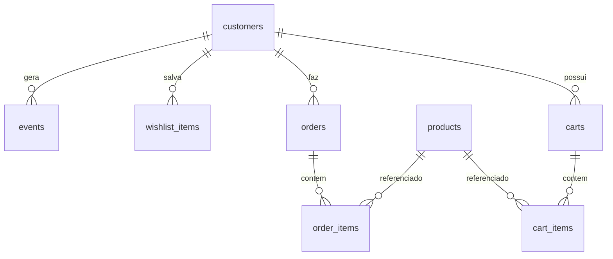
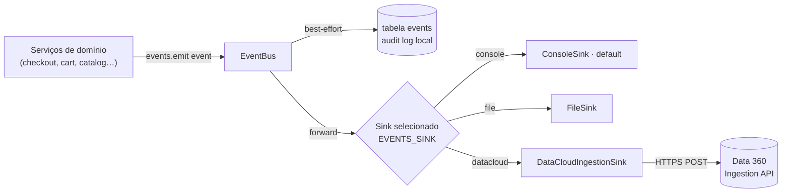

# TechLar E-commerce — Documentação Técnica

> Site de e-commerce **externo** da TechLar. Sistema autônomo, com **banco de dados
> próprio (PostgreSQL)**, que atua como um **silo de dados real** e emite **eventos
> de negócio** através de uma **camada de sink plugável**. Um dos sinks disponíveis
> envia esses eventos para a **Salesforce Data 360 (Data Cloud) Ingestion API** —
> mas isso é apenas um destino HTTP, **desligado por padrão**.

> ⚠️ **Nenhuma org Salesforce é tocada por este código.** Não há autenticação de
> org, deploy de metadados ou SOQL. A única integração de saída é um `POST` HTTP
> opcional feito pelo `DataCloudIngestionSink`, inativo a menos que
> `EVENTS_SINK=datacloud`.

---

## 1. Visão geral

| Item | Descrição |
| --- | --- |
| **Propósito** | Storefront externo da TechLar que serve de fonte de dados ("silo") para o Data 360 unificar perfis e operação |
| **Stack backend** | Node.js ≥ 20, Express 4, PostgreSQL (`pg`), JWT, arquitetura em camadas/modular |
| **Stack frontend** | React 18 + Vite (SPA), Context API, `fetch` |
| **Banco de dados** | PostgreSQL próprio (não é a org) |
| **Integração-chave** | Camada de eventos plugável → Data 360 Ingestion API |
| **Deploy** | Heroku single-dyno (API + SPA no mesmo processo) |
| **Testes** | 28 testes unitários (`node --test`), sem necessidade de banco |

**Por que um site externo?** No caso de uso da TechLar, o e-commerce já existiria
como sistema legado, com cadastros no seu **próprio banco**, divergentes do CRM.
Isso é exatamente o cenário que **justifica** o Data 360: unificar identidades
fragmentadas (Golden Record) e habilitar Calculated Insights e Agentforce sobre um
perfil consolidado. O site foi propositalmente semeado com **variância de
identidade** (mesma pessoa com pequenos divergências) para exercitar a Identity
Resolution.

---

## 2. Estrutura do repositório

```
techlar-ecommerce/
├── brand/                    # Ativos de marca (logo)
├── client/                   # SPA React + Vite
│   ├── src/
│   │   ├── api/              # client.js — wrapper de fetch + x-device-id
│   │   ├── context/         # DeviceContext, AuthContext, CartContext
│   │   ├── components/       # Navbar, Footer, ProductCard, etc.
│   │   ├── pages/            # 10 páginas (Home, Catálogo, Produto, Carrinho…)
│   │   └── styles.css
│   └── vite.config.js       # proxy /api → :3001 em dev
├── server/                   # API REST Node + Express (camadas, modular)
│   ├── src/
│   │   ├── catalog/ cart/ checkout/ customers/ orders/ wishlist/   # módulos de domínio
│   │   ├── events/          # ⭐ camada plugável Data 360
│   │   ├── db/              # pool, migrations, seed
│   │   ├── config/ http/ middleware/ utils/
│   │   ├── app.js           # montagem do Express
│   │   └── index.js         # bootstrap do servidor
│   └── test/                # testes unitários (cart, checkout, event sink)
├── docs/                     # esta documentação + guia de ingestão Data 360
├── Procfile                  # web: npm start · release: npm run migrate
├── package.json              # scripts de orquestração + Heroku
└── README.md
```

### Padrão modular do backend

Cada módulo de domínio isola responsabilidades:

```
server/src/<modulo>/
├── <modulo>.routes.js        # roteamento HTTP (Express Router)
├── <modulo>.controller.js    # adapta req/res ↔ serviço
├── <modulo>.service.js       # orquestração + regras de negócio (I/O)
├── <modulo>.repository.js    # acesso a dados (SQL)
└── <modulo>.logic.js         # regras PURAS (sem I/O) — testáveis unitariamente
```

Essa separação garante que a **lógica de negócio pura** (`cart.logic.js`,
`checkout.logic.js`) seja testável sem banco e independente de HTTP.

---

## 3. Modelo de dados (PostgreSQL)

Definido em `server/src/db/migrations/001_init.sql`.

| Tabela | Papel | Observações |
| --- | --- | --- |
| `customers` | Clientes | `email`/`documento` **NÃO** são únicos — variância de identidade proposital. Coluna aditiva `password_hash` (nullable) para login |
| `products` | Catálogo | `sku` único; ~16 produtos de tecnologia para casa |
| `carts` | Carrinhos | 1 carrinho `open` por device anônimo **ou** por cliente (índices únicos parciais) |
| `cart_items` | Itens do carrinho | `UNIQUE(cart_id, product_id)`; não guarda garantia |
| `orders` | Pedidos | `order_number` único; `status` default `confirmed` |
| `order_items` | Itens do pedido | Guarda `warranty` por linha |
| `events` | **Log local append-only** de todo evento emitido | Espelho de auditoria, independente do sink |
| `wishlist_items` | Lista de desejos (bônus) | `UNIQUE(customer_id, product_id)` |

**Decisão de projeto — variância de identidade:** `customers` intencionalmente
permite duplicatas. O `seed` gera ~40 registros a partir de 18 pessoas reais,
variando: casing de e-mail, formatação de telefone (`+55…`, `(11)…`, dígitos
puros), CPF (mascarado vs. dígitos), grafia do nome (com/sem acento, nome+sobrenome)
e `device_id` (às vezes compartilhado entre variantes — sinal de resolução).
É essa bagunça controlada que o Data 360 vai reconciliar.



---

## 4. Camada de eventos (⭐ integração central com Data 360)

Arquivos: `server/src/events/` (ver também `server/src/events/README.md`).

O domínio **nunca** conhece o destino. Ele só chama `events.emit(event)` (ou um
helper tipado como `events.orderPlaced(...)`). O destino é escolhido em runtime
por uma variável de ambiente.



### 4.1 Componentes

| Arquivo | Responsabilidade |
| --- | --- |
| `eventBuilders.js` | Funções **puras** que montam o envelope canônico do evento |
| `EventBus.js` | Facade de emissão: (1) espelha no `events` local, (2) encaminha ao sink. Ambos **best-effort** |
| `index.js` | Singleton preguiçoso do bus + API de alto nível (`events.identify`, `events.orderPlaced`…) |
| `sinks/ConsoleSink.js` | Imprime evento estruturado (default) |
| `sinks/FileSink.js` | Anexa JSON lines em `EVENTS_FILE_PATH` |
| `sinks/DataCloudIngestionSink.js` | `POST` para a Ingestion API com retry/backoff exponencial |
| `sinks/index.js` | **Factory** que escolhe o sink a partir de `EVENTS_SINK` |

### 4.2 Envelope canônico do evento

```jsonc
{
  "event_type": "order_placed",
  "event_id": "0f8c…-uuid",              // único por evento (chave de idempotência)
  "occurred_at": "2026-08-07T12:34:56.000Z",
  "customer_ref": {                       // identificadores p/ Identity Resolution
    "email": "ana.souza@example.com",
    "phone": "+55 (11) 98765-4321",
    "document": "390.533.447-05",
    "device_id": "web-3-a"                // chave de navegação anônima
  },
  "payload": { /* específico do tipo */ }
}
```

`customer_ref` carrega **o que estiver disponível** no momento (para tráfego
anônimo, muitas vezes só `device_id`). Combinado à variância do seed, é isso que
permite ao Data 360 **resolver identidades** entre eventos.

### 4.3 Catálogo de eventos (conjunto mínimo)

| `event_type` | Emitido quando | Campos-chave do `payload` |
| --- | --- | --- |
| `identify` | Registro e login | `reason` (`register`\|`login`) |
| `product_viewed` | Página de produto é buscada | `product_id`, `sku`, `nome`, `categoria`, `preco` |
| `cart_updated` | Item adicionado/removido/qtd alterada | `action`, `items[]`, `subtotal`, `item_count` |
| `checkout_started` | Início da revisão do checkout | `items[]`, `subtotal`, `total`, `item_count` |
| `order_placed` | Pedido criado | `order_number`, `items[]`, `subtotal`, `total`, `status` |

> **Abandono de carrinho é derivado no Data 360, não aqui.** O site só emite os
> sinais crus (`cart_updated`/`checkout_started` com `device_id` estável + timestamps,
> e `order_placed` na conversão). O Data 360 deriva o abandono (sinal de carrinho
> sem `order_placed` dentro de uma janela). Detalhes no guia de ingestão.

### 4.4 Garantias operacionais

- **Fire-and-forget / best-effort:** uma falha no banco local **ou** no endpoint de
  ingestão é logada e engolida — **nunca** quebra uma compra.
- **Retry com backoff exponencial** no `DataCloudIngestionSink`; erros 4xx (exceto
  429) falham rápido, 5xx/429/rede são reprocessados.
- **Trocar destino = 1 variável** (`EVENTS_SINK`), sem tocar no domínio.

---

## 5. API REST

Base: `/api`. Autenticação por `Authorization: Bearer <jwt>`; contexto anônimo por
header `x-device-id` (localStorage no cliente).

| Método | Rota | Auth | Descrição | Evento emitido |
| --- | --- | --- | --- | --- |
| GET | `/health` | — | Health-check (não toca o banco) | — |
| GET | `/api/catalog/products` | — | Lista produtos (filtro por categoria/busca) | — |
| GET | `/api/catalog/products/featured` | — | Produtos em destaque | — |
| GET | `/api/catalog/products/:id` | — | Detalhe do produto | `product_viewed` |
| GET | `/api/catalog/categories` | — | Lista de categorias | — |
| GET | `/api/cart` | opcional | Carrinho atual (por device ou cliente) | — |
| POST | `/api/cart/items` | opcional | Adiciona item | `cart_updated` |
| PATCH | `/api/cart/items/:productId` | opcional | Altera quantidade | `cart_updated` |
| DELETE | `/api/cart/items/:productId` | opcional | Remove item | `cart_updated` |
| POST | `/api/checkout/start` | opcional | Revisão + totais (com garantia) | `checkout_started` |
| POST | `/api/checkout/confirm` | opcional | Confirma pedido (guest ou logado) | `order_placed` |
| GET | `/api/orders` | **sim** | Pedidos do cliente | — |
| GET | `/api/orders/:orderNumber` | **sim** | Detalhe do pedido | — |
| POST | `/api/auth/register` | — | Cadastro | `identify` (register) |
| POST | `/api/auth/login` | — | Login | `identify` (login) |
| GET | `/api/customers/me` | **sim** | Perfil | — |
| PATCH | `/api/customers/me` | **sim** | Atualiza perfil | — |
| GET/POST/DELETE | `/api/wishlist` | **sim** | Lista de desejos (bônus) | — |

### Regras de negócio relevantes

- **Carrinho anônimo → cliente:** o carrinho aberto por `x-device-id` é **mesclado**
  ao cliente no login/registro/checkout (índices únicos parciais garantem 1 carrinho
  aberto por device/cliente).
- **Garantia estendida:** taxa por linha = `WARRANTY_RATE` (default 15%) × preço
  unitário × qtd. `subtotal` **exclui** garantia; `total` **inclui**. A mesma função
  pura `computeCartTotals` alimenta preview do carrinho e totais do pedido.
- **Número do pedido:** formato `TL-AAAAMMDD-XXXXXX` com alfabeto sem ambiguidade
  (sem `0/O/1/I`); unicidade garantida por retry via `SAVEPOINT`.
- **Guest checkout:** captura identidade (nome/email/telefone/documento) e cria o
  cliente na confirmação. Pagamento é simulado → `status = confirmed`.

---

## 6. Frontend (React + Vite)

- **Contextos:** `DeviceContext` (gera/persiste `x-device-id`), `AuthContext` (JWT +
  usuário), `CartContext` (estado do carrinho, seleção de garantia em localStorage).
- **Páginas (10):** Home, Catálogo, Produto, Carrinho, Checkout, Confirmação, Login,
  Registro, Perfil, Wishlist.
- **`api/client.js`:** wrapper de `fetch` que injeta `x-device-id` e o Bearer token.
- Em dev, o Vite faz proxy de `/api` para `http://localhost:3001`.

---

## 7. Configuração (variáveis de ambiente)

Referência completa em `server/.env.example`.

| Variável | Default | Propósito |
| --- | --- | --- |
| `DATABASE_URL` | — | Postgres próprio do site |
| `PGSSL` | `false` | `true` no Heroku Postgres |
| `JWT_SECRET` | `dev-secret…` | Assinatura de tokens |
| `JWT_EXPIRES_IN` | `7d` | Validade do token |
| `WARRANTY_RATE` | `0.15` | Taxa da garantia estendida |
| `EVENTS_SINK` | `console` | `console` \| `file` \| `datacloud` |
| `EVENTS_PERSIST_LOCAL` | `true` | Espelha eventos na tabela `events` |
| `EVENTS_FILE_PATH` | `./events.log` | Caminho do FileSink |
| `DATACLOUD_INGESTION_URL` | — | Base da Ingestion API (só no sink datacloud) |
| `DATACLOUD_CONNECTOR` | — | Nome do source/connector de ingestão |
| `DATACLOUD_TOKEN` | — | Bearer token da Ingestion API |
| `DATACLOUD_OBJECT` | `ecommerce_events` | Objeto de ingestão alvo |
| `DATACLOUD_MAX_RETRIES` | `3` | Tentativas de retry |
| `DATACLOUD_RETRY_BASE_MS` | `300` | Base do backoff exponencial |

---

## 8. Como rodar

```bash
# 1. Instalar as duas aplicações
npm run install:all

# 2. Configurar ambiente
cp server/.env.example server/.env      # editar DATABASE_URL, JWT_SECRET

# 3. Banco (requer Postgres + DATABASE_URL)
npm run migrate                          # migrations versionadas
npm run seed                             # dados demo idempotentes (variância de identidade)

# 4. Rodar (dois terminais)
npm run dev:server                       # http://localhost:3001  (health: /health)
npm run dev:client                       # http://localhost:5173  (proxy /api → server)

# Testes (sem banco) e build de produção
npm test                                 # 28 testes unitários
npm run build && npm start               # servidor serve client/dist na $PORT
```

Login demo (após `seed`): `demo@techlar.com` / `techlar123`.

> O servidor **sobe sem banco** e `GET /health` **não** toca o banco (o pool conecta
> preguiçosamente na primeira query). Os testes de domínio/sink também dispensam
> Postgres.

---

## 9. Deploy (Heroku, single-dyno)

```bash
heroku create techlar-ecommerce
heroku addons:create heroku-postgresql:essential-0     # provê DATABASE_URL
heroku config:set PGSSL=true JWT_SECRET="$(openssl rand -hex 32)" EVENTS_SINK=console
git push heroku main
heroku run npm run seed                                  # (opcional, 1x)
```

- **Build:** `heroku-postbuild` instala ambos os pacotes + builda o cliente.
- **Release:** processo `release:` do `Procfile` roda `npm run migrate`.
- **Web:** processo `web:` roda `npm start`, servindo API + `client/dist`.

Para ligar o sink do Data 360 em produção, ver `docs/INGESTAO-DATA360.md`.

---

## 10. Testes

`node --test` (runner nativo, zero dependências extras). 28 testes cobrindo:

- **`cart.logic.test.js`** — subtotal, linha com/sem garantia, arredondamento, `normalizeQty`.
- **`checkout.logic.test.js`** — geração/validação do número do pedido, `buildOrderDraft`.
- **`eventSink.test.js`** — EventBus com **fake sink** (best-effort não propaga erro),
  FileSink, e `DataCloudIngestionSink` (retry/backoff e fail-fast em 4xx) com `fetch` injetado.

```bash
npm test
```

---

## 11. Decisões de projeto (resumo)

- **`customers.password_hash` nullable** — único campo aditivo além da spec, para
  permitir login; registros de variância ficam com `NULL` (identidade pura).
- **Senhas com `scrypt` nativo** e **testes com `node --test`** → zero dependências
  extras de runtime/teste.
- **Migration runner leve** (`schema_migrations`, transação por arquivo) em vez de Knex.
- **Garantia** não fica em `cart_items` (schema fiel): é seleção por linha (localStorage)
  aplicada no checkout em `order_items.warranty`.
- **Eventos best-effort + espelho local** (`EVENTS_PERSIST_LOCAL`); abandono derivado
  no Data 360.
- **Sink Data Cloud** desligado por padrão; só faz `POST` HTTPS, sem tocar org.

---

## 12. Documentos relacionados

- [`docs/INGESTAO-DATA360.md`](INGESTAO-DATA360.md) — processo de ingestão pelo Data 360,
  melhores práticas, mapeamento DLO→DMO e passo a passo de wiring.
- [`docs/data360/ecommerce_events.yaml`](data360/ecommerce_events.yaml) — schema OpenAPI 3.0
  pronto para upload na Ingestion API.
- [`README.md`](../README.md) — quick start.
- [`server/src/events/README.md`](../server/src/events/README.md) — schema dos eventos.
