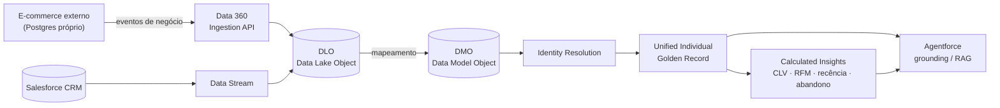

# Ingestão do E-commerce pelo Data 360 — Guia e Melhores Práticas

> Como os eventos do e-commerce externo da TechLar chegam ao **Salesforce Data 360
> (Data Cloud)**, viram um **Golden Record** (perfil unificado), alimentam
> **Calculated Insights** e servem de **grounding** para o Agentforce.
>
> Esta é a parte de **ingestão** — de responsabilidade do Ricardo. Aqui você
> encontra: o processo ponta a ponta, qual mecanismo usar e por quê, o schema
> pronto ([`data360/ecommerce_events.yaml`](data360/ecommerce_events.yaml)),
> o mapeamento até o DMO e as melhores práticas.

---

## 1. O panorama: por que ingestão importa aqui

O site é um **silo real**: tem banco próprio, cadastros divergentes do CRM e
tráfego anônimo. Sozinho, ele não gera valor de CRM. A ingestão é a ponte que
transforma esse silo em sinal aproveitável:



**Ideia central:** o e-commerce só **emite sinais crus** (visualização, carrinho,
checkout, pedido, identificação). Tudo que é *derivado* (abandono, CLV, segmento)
é calculado **no Data 360**, sobre o perfil já unificado. Isso mantém o site
simples e coloca a inteligência onde ela pertence.

---

## 2. Qual mecanismo de ingestão? (e por que Ingestion API)

O Data 360 oferece várias formas de trazer dados. Para o nosso caso:

| Mecanismo | Quando usar | Serve para nós? |
| --- | --- | --- |
| **Ingestion API — Streaming** | Eventos em tempo (quase) real, pequenos lotes via HTTP `POST` | ✅ **Sim** — é o coração do caso de uso (comportamento em tempo real) |
| **Ingestion API — Bulk** | Cargas grandes/históricas via upload de CSV em jobs | ✅ **Sim** — para o *backfill* inicial do histórico de pedidos/clientes |
| CRM / Salesforce connector | Dados que já estão numa org Salesforce | ➖ Usado para o lado CRM, não para o site externo |
| Connectors gerenciados (S3, GA, etc.) | Fontes SaaS/arquivo com conector nativo | ➖ Não se aplica a um app Node próprio |
| MuleSoft / Zero-copy | Integrações corporativas / federação sem cópia | ➖ Overkill para o bootcamp |

**Decisão:** **Ingestion API** — *Streaming* para o fluxo contínuo de eventos e
*Bulk* (uma vez) para carregar o histórico semeado. É exatamente o que o
`DataCloudIngestionSink` do site já fala (HTTP `POST` com `{ "data": [...] }`).

> **Streaming vs Bulk — regra prática:** streaming para o "agora" (baixa latência,
> lotes pequenos ≤ ~200 registros/req); bulk para "o passado" (muitos registros de
> uma vez). Nunca use streaming para despejar um histórico inteiro — use bulk.

---

## 3. Processo ponta a ponta (o que acontece com um evento)

1. **Emissão (site):** um serviço de domínio chama `events.orderPlaced(...)`. O
   `EventBus` encaminha ao sink configurado.
2. **POST (sink):** com `EVENTS_SINK=datacloud`, o `DataCloudIngestionSink` faz
   `POST {url}/api/v1/ingest/sources/{connector}/{object}` com
   `{ "data": [ evento ] }` e `Authorization: Bearer <token>`.
3. **DLO:** o Data 360 grava o registro no **Data Lake Object** correspondente ao
   objeto do schema (`ecommerce_events` ou `ecommerce_order_items`).
4. **Mapeamento → DMO:** você mapeia campos do DLO para um **Data Model Object**
   padrão/custom (harmonização). Ex.: `email`, `phone`, `document`, `device_id` →
   atributos do DMO de contato/indivíduo; métricas → DMO de engajamento/pedido.
5. **Identity Resolution:** regras de match (e-mail normalizado, telefone, documento,
   device) reconciliam variantes num **Unified Individual** (Golden Record).
6. **Calculated Insights:** SQL do Data 360 calcula CLV, ticket médio, frequência,
   recência, RFM, health score, abandono — por Unified Individual.
7. **Consumo:** segmentos, ações, e **grounding do Agentforce** (RAG) usam o perfil
   unificado + insights.

---

## 4. Autenticação (OAuth 2.0 — JWT Bearer Flow)

A Ingestion API é server-to-server. O padrão recomendado é o **OAuth 2.0 JWT
Bearer Flow** (sem interação humana, ideal para um backend):

1. Criar uma **Connected App** na org com:
   - OAuth scopes: `Manage Data Cloud Ingestion API data (cdp_ingest_api)`,
     `Perform requests at any time (refresh_token, offline_access)`, `api`.
   - **Use digital signatures** com um certificado (chave privada fica no servidor).
2. O backend gera um **JWT** assinado (issuer = consumer key, subject = usuário de
   integração, audience = login URL) e troca por um **access token** no endpoint
   `/services/oauth2/token`.
3. Trocar o access token pelo **Data Cloud token** (endpoint
   `/services/a360/token`) — é este token, com a **instanceUrl do Data Cloud**, que
   o sink usa no `Bearer` e na base URL.

> No app atual, `DATACLOUD_TOKEN` e `DATACLOUD_INGESTION_URL` são injetados via env
> — o sink **não** implementa o handshake OAuth (mantém o site desacoplado da org).
> **Próximo passo (quando formos ligar de fato):** um pequeno `tokenProvider` que
> faz o JWT flow e renova o token antes de expirar. Documentado como TODO abaixo,
> **não implementado** (depende de criar a Connected App na org).

**Nunca** commite chave privada, consumer secret ou tokens. Use `heroku config` /
variáveis de ambiente. O `.env` já é gitignored.

---

## 5. "Shaping" do payload (achatar antes de enviar)

A Ingestion API **não** aceita objetos aninhados nem arrays num objeto de schema.
O evento do site é aninhado (`customer_ref`, `payload`, `items[]`). Portanto, antes
do `POST`, o evento precisa ser **achatado** para bater com
[`ecommerce_events.yaml`](data360/ecommerce_events.yaml):

```js
// Transformação recomendada (a ser aplicada no DataCloudIngestionSink no wiring).
// Mantém o event_id como chave de deduplicação e serializa os itens.
function flattenForIngestion(event) {
  const { event_type, event_id, occurred_at, customer_ref = {}, payload = {} } = event;
  return {
    event_id,
    event_type,
    occurred_at,
    email: customer_ref.email ?? null,
    phone: customer_ref.phone ?? null,
    document: customer_ref.document ?? null,
    device_id: customer_ref.device_id ?? null,
    reason: payload.reason ?? null,
    product_id: payload.product_id != null ? String(payload.product_id) : null,
    sku: payload.sku ?? null,
    product_name: payload.nome ?? null,
    category: payload.categoria ?? null,
    price: payload.preco ?? null,
    action: payload.action ?? null,
    order_number: payload.order_number ?? null,
    status: payload.status ?? null,
    item_count: payload.item_count ?? null,
    subtotal: payload.subtotal ?? null,
    total: payload.total ?? null,
    items_json: payload.items ? JSON.stringify(payload.items) : null,
  };
}

// Para order_placed, também emitir uma linha por item ao objeto
// ecommerce_order_items:
function orderItemRows(event) {
  const p = event.payload || {};
  return (p.items || []).map((it) => ({
    line_id: `${p.order_number}:${it.product_id}`,
    order_number: p.order_number,
    occurred_at: event.occurred_at,
    product_id: String(it.product_id),
    qty: it.qty,
    unit_price: it.unit_price,
    warranty: Boolean(it.warranty),
    email: event.customer_ref?.email ?? null,
    device_id: event.customer_ref?.device_id ?? null,
  }));
}
```

> **Estado atual:** o `DataCloudIngestionSink` envia o **envelope aninhado**. A
> aplicação de `flattenForIngestion`/`orderItemRows` é a única mudança de código
> necessária no momento de ligar a ingestão de verdade. Deixei como próximo passo
> (não alterei o sink agora para não mudar o contrato/tests sem necessidade —
> a decisão pode ser: achatar no sink, ou mapear no Data Stream).

---

## 6. Passo a passo do wiring (lado org) — ⏸️ pendente de aprovação

> Estes passos **tocam a org** `agentforce`. Conforme combinado, **não** executei
> nada disso ainda. É a checklist para quando você aprovar.

- [ ] **Connected App** com scope `cdp_ingest_api` + JWT (certificado).
- [ ] **Ingestion API source** (connector) no Data Cloud → anotar o `sourceApiName`.
- [ ] **Upload do schema** [`ecommerce_events.yaml`](data360/ecommerce_events.yaml)
      → cria os DLOs `ecommerce_events` e `ecommerce_order_items`.
- [ ] **Data Stream** a partir do source; definir:
      - **Primary key:** `event_id` (e `line_id` no objeto de itens).
      - **Event time field:** `occurred_at`.
      - **Category:** Engagement (eventos) / Profile ou Other (itens).
- [ ] **Mapeamento DLO → DMO** (harmonização) — ver seção 7.
- [ ] **Identity Resolution ruleset** — ver seção 8.
- [ ] **Calculated Insights** — reaproveitar os SQLs de `sprint4-data360/03-...`.
- [ ] **Teste:** ligar `EVENTS_SINK=datacloud` + credenciais e validar a chegada
      no Data Stream (Data Explorer).
- [ ] **Bulk backfill** do histórico semeado (uma vez).

---

## 7. Mapeamento DLO → DMO (harmonização)

| Campo DLO (`ecommerce_events`) | DMO alvo (sugerido) | Uso |
| --- | --- | --- |
| `email`, `phone`, `document` | Individual / Contact Point (Email/Phone) | **Chaves de Identity Resolution** |
| `device_id` | Party Identification / Device | Liga tráfego anônimo pré-login |
| `event_type`, `occurred_at` | Engagement (custom) | Timeline de comportamento |
| `product_id`, `sku`, `category`, `price` | Product / Engagement | Interesse por produto/categoria |
| `subtotal`, `total`, `item_count` | Engagement / Order Summary | Métricas de sessão/pedido |
| `order_number`, `status` | Sales Order (custom) | Conversões |
| `ecommerce_order_items.*` | Sales Order Product / line | Receita por item, attach de garantia |

Prefira **DMOs padrão** quando existirem (melhor interoperabilidade com Agentforce
e recursos prontos); use DMOs custom só para o que não encaixar.

---

## 8. Identity Resolution (Golden Record)

Regras de match sugeridas (do mais forte ao mais fraco):

1. **Documento (CPF) normalizado** — match exato → altíssima confiança.
2. **E-mail normalizado** (lowercase, trim) — match exato → alta confiança.
3. **Telefone normalizado** (só dígitos, com DDI) — match exato.
4. **`device_id`** — sinal de reconciliação para tráfego anônimo (usar com
   critério, junto de outro atributo, para evitar juntar pessoas que dividem device).

> A **normalização** (lowercase de e-mail, dígitos de telefone/CPF) deve ser feita
> no **DMO/regra**, não no site — o site emite os dados "sujos" de propósito. É
> isso que demonstra o valor do Data 360.

---

## 9. Melhores práticas de ingestão (checklist)

- **Idempotência:** sempre enviar um **`event_id`** único e usá-lo como primary key
  do Data Stream. Reenvios (retry) não duplicam. ✅ o site já gera `event_id` (UUID).
- **Event time explícito:** enviar `occurred_at` (UTC, ISO 8601) e marcá-lo como
  event time field — não confie no horário de chegada. ✅ o site já envia.
- **Lotes pequenos no streaming:** agrupar eventos (ex.: ≤ 200/req) reduz overhead
  sem estourar limites. Hoje o sink envia 1 evento/req; um **micro-batch** (buffer +
  flush por tempo/tamanho) é uma otimização recomendada.
- **Backoff + retry:** repetir em 5xx/429/rede com backoff exponencial; falhar
  rápido em 4xx (payload inválido). ✅ já implementado no sink.
- **Best-effort no site:** ingestão **nunca** pode quebrar uma compra. ✅ o
  `EventBus` engole falhas e loga.
- **Tipos primitivos + achatado:** sem objetos/arrays aninhados no schema (ver §5).
- **PII e governança:** trafegue só o necessário; classifique `email`/`phone`/
  `document` como PII no Data 360; use HTTPS (padrão) e rotacione tokens. Considere
  não enviar CPF completo se não for essencial para o match.
- **Schema como contrato:** versione o `.yaml`; mudanças de schema são
  aditivas quando possível (adicionar campos, não renomear/remover).
- **Observabilidade:** manter o **espelho local** (`EVENTS_PERSIST_LOCAL=true`) como
  auditoria independente do sink — permite reconciliar "o que emiti" vs. "o que chegou".
- **Backfill separado do streaming:** histórico via **Bulk**; contínuo via
  **Streaming**. Não misture.

---

## 10. Como ligar (produção) quando estiver aprovado

```bash
heroku config:set \
  EVENTS_SINK=datacloud \
  DATACLOUD_INGESTION_URL="https://<instance>.c360a.salesforce.com" \
  DATACLOUD_CONNECTOR="<sourceApiName>" \
  DATACLOUD_OBJECT="ecommerce_events" \
  DATACLOUD_TOKEN="<data-cloud-access-token>"
```

Localmente, os mesmos valores em `server/.env`. Com o `tokenProvider` (TODO §4),
`DATACLOUD_TOKEN` deixa de ser estático e passa a ser renovado via JWT flow.

---

## 11. Resumo dos artefatos

| Arquivo | O que é |
| --- | --- |
| [`data360/ecommerce_events.yaml`](data360/ecommerce_events.yaml) | Schema OpenAPI 3.0 pronto p/ upload (DLOs `ecommerce_events` + `ecommerce_order_items`) |
| `server/src/events/sinks/DataCloudIngestionSink.js` | Sink HTTP com retry/backoff (envio) |
| `server/src/events/README.md` | Catálogo e envelope dos eventos |
| Esta doc | Processo, mecanismo, auth, shaping, mapeamento, boas práticas |

**TODOs de código (no wiring, com sua aprovação):**
1. `flattenForIngestion` + `orderItemRows` no sink (ou mapeamento no Data Stream).
2. `tokenProvider` (OAuth 2.0 JWT Bearer Flow) para renovar o token.
3. (Opcional) micro-batch de eventos no sink.
